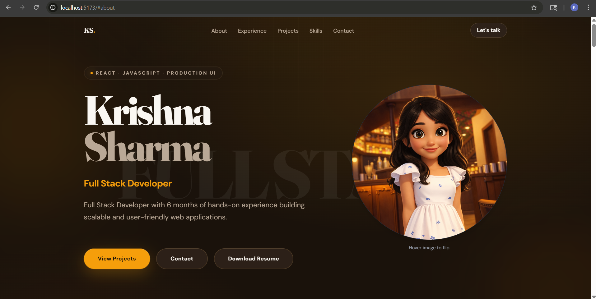

## 🚀 Live Portfolio

🔗 https://portfolio-pi-eight-epcw8688vr.vercel.app



# 🚀 Krishna Sharma - Portfolio

[](https://portfolio-pi-eight-epcw8688vr.vercel.app)
[](https://github.com/krishnash648/portfolio)
[]()

---

## 👨‍💻 About Me

I am a **Full Stack Developer** with hands-on experience building scalable and user-friendly web applications.  
I focus on writing clean, maintainable code and delivering smooth user experiences.

---

## ✨ Features

- 🔥 Modern UI with smooth animations  
- 🎭 Interactive profile flip (cartoon → real image on hover)  
- 📱 Fully responsive design  
- 💼 Project showcase with live demo & GitHub links  
- 💬 WhatsApp contact integration  
- 📄 Resume download option  

---

## 🛠 Tech Stack

### Frontend
- React.js  
- JavaScript (ES6+)  
- HTML5 & CSS3  
- Tailwind CSS  

### Backend & Data
- Node.js  
- Express.js  
- MongoDB  
- REST APIs  

### Tools
- Git & GitHub  
- Postman  
- AWS  

---

## 📂 Featured Projects

### 🔹 DashGenie (Featured)
- Admin dashboard with Kanban board & data visualization  
- Built using component-based architecture  

### 🔹 Velvet Cart
- E-commerce application  
- Product listing, cart system, responsive UI  

---

## 📬 Contact

- 📧 Email: sharmakrishna1605@gmail.com  
- 💬 WhatsApp: https://wa.me/919664480918  
- 💻 GitHub: https://github.com/krishnash648  

---

## ## ⚙️ Run Locally

```bash
git clone https://github.com/krishnash648/portfolio.git
cd portfolio
npm install
npm run dev
```

---

## 🌐 Deployment

Deployed using **Vercel**

---

📌 Note
This portfolio is continuously improving as I learn and build more real-world projects.

⭐ If you like this project, feel free to star the repo!


---

# 🔥 What improved

- ✅ Fixed code block issue  
- ✅ Added badges (looks pro on GitHub)  
- ✅ Clean spacing  
- ✅ No AI cringe wording  
- ✅ Recruiter-friendly  

---
## 👨‍💻 Author

**Krishna Sharma**

- GitHub: https://github.com/krishnash648  
- LinkedIn: (https://www.linkedin.com/in/krishna-sharma-539184215/)
----
